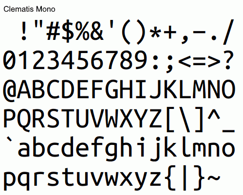

It is influenced by Consolas, Inconsolata, and Menlo, with its own adjustments.

Fixed 'Ubuntu Mono (Clematis Mono)' and combine 'Clematis Mono' and 'M+' fonts.  

Changed 'Ubuntu Mono'
---------------------

 

Clematis Mono v1.0.0 - 2017.10.28
---------------------------------
- Remove hint instruction (ヒント命令を削除)
- `$`         : Connect vertical lines (縦線をつなげる)
- `*`         : Center aligned in vertical direction (縦方向を中央揃え)
- `G`         : Add a horizontal line (横線をつける)
- `J` `j` `l` : Remove lines (セリフを取り除く)
- `i`         : Take a tail (しっぽをとる)
- `-` `_`     : Corrected to the same width as `+` (`+`と同じ横幅に修正)
- `0`         : Fix dots as slash (ドットをスラッシュに修正)
- `1`         : Remove the bottom line (下部の線を取り除く)

 

Clematis v1.0.63 - 2017.10.27
-----------------------------
- 'M+ 1m' と 'Clematis Mono' を結合したもの
- 'M+ 1m' は TESTFLIGHT-063 を使用
- フォント情報は [Migu](http://mix-mplus-ipa.osdn.jp/migu/) を参考
- 'M+ 1m' の 0x20～0x7e, 0xa0～0x24f までを 'Clematis Mono' で置き換え
- 上記以外の 'M+ 1m' にない文字を 'Clematis Mono' で補完
- サイズ調整のため 'Clematis Mono' を 108% に変形

 

***
(C) 2017 niki.
